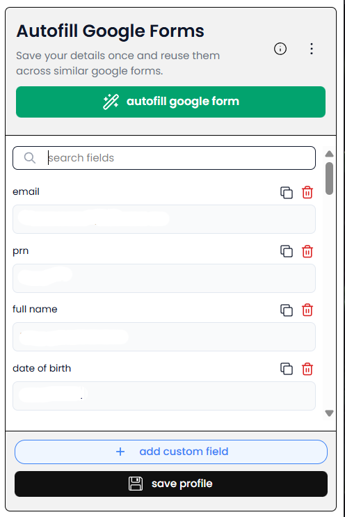
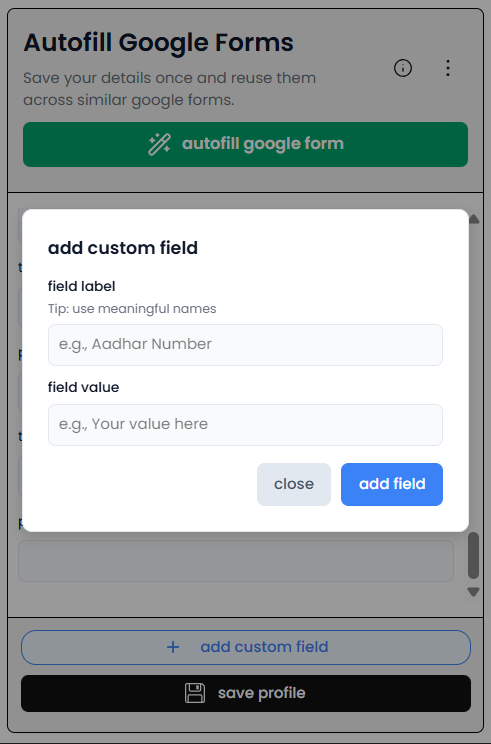
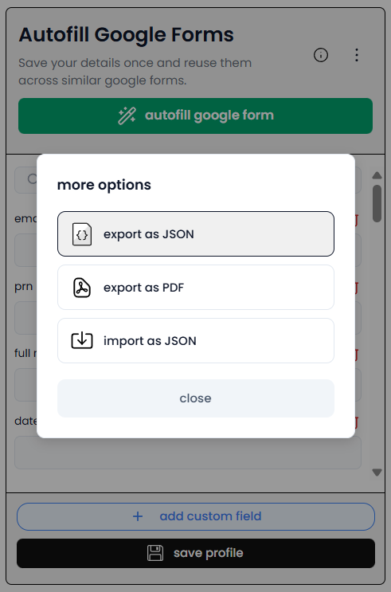
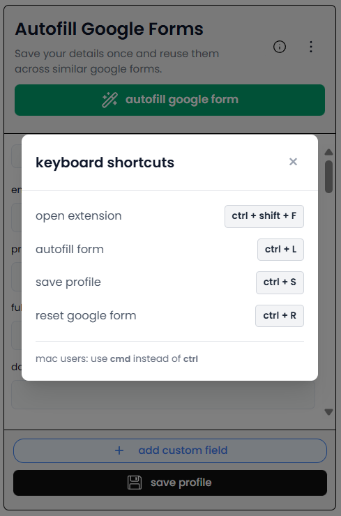

# Fillio (v2.0.0) - Autofill google forms in seconds

[](https://github.com/tejaspokale22/fillio/stargazers)
[](https://github.com/tejaspokale22/fillio/network/members)

A browser extension designed to streamline the process of filling out repetitive Google Forms. Save your info once and autofill it across similar forms in a single click.

[Watch demo](https://drive.google.com/file/d/1EBITzqwqtaMwPD7KRIfyW454VBE9T8vr/view?usp=sharing)

## Installation

### Microsoft Add-ons

Install directly from the Microsoft Add-ons:

**[Add to Microsoft Edge](https://microsoftedge.microsoft.com/addons/detail/cbkbaoajmojgagkplfihcajkagokcnif)**

### Manual Installation

1. Clone this repository

   ```bash
   git clone https://github.com/tejaspokale22/fillio.git
   cd fillio
   ```

2. Install dependencies

   ```bash
   cd client
   npm install
   ```

3. Build the extension

   ```bash
   npm run build
   ```

4. Load in Chrome
   - Navigate to `chrome://extensions/`
   - Enable "Developer mode"
   - Click "Load unpacked"
   - Select the `client/dist` folder

## Features

- **Profile management**
  - Save your details once and reuse them across similar forms
  - Add custom fields for form-specific questions
- **One-click autofill**
  - Automatically fills common Google Form fields (text, dropdowns, radios, checkboxes)
  - AI-powered intelligent matching for higher accuracy        
- **Import & export**
  - Import or export your profile as JSON
  - Export your profile as a PDF
- **Productivity utilities**
  - Search and filter fields, copy values quickly
  - Keyboard shortcuts: `Ctrl+S`, `Ctrl+L`, `Ctrl+R`, `Ctrl+Shift+F`

## Screenshots

### Main Interface



Main extension popup with saved form fields and quick access controls.

### Adding Custom Fields



Add custom fields by specifying label keywords that match form field labels.

### More Options



Access JSON import/export and PDF generation features.

### Keyboard Shortcuts



View all available keyboard shortcuts for quick access.

## Usage

1. Open the extension (`Ctrl+Shift+F`)
2. Fill/update your profile → Save (`Ctrl+S`)
3. Open a Google Form → Autofill (`Ctrl+L`) or Reset (`Ctrl+R`)

Use **custom fields** for form-specific questions. Import/export is available via **More Options** (JSON/PDF).

## Privacy & Security

- Your saved profile stays in the browser
- The extension requests only the permissions required to autofill Google Forms
